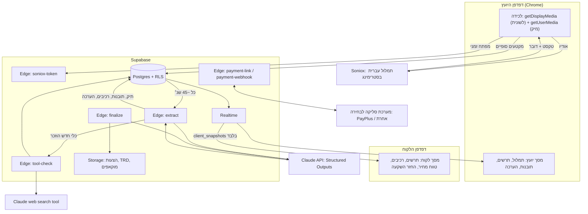

# LiveScope: תכנון טכני להקמת המערכת

> מסמך עבודה. המקור הוא דף הקונספט (`LiveScope.dc.html`) והבריף (`LiveScope-design-brief.md`). כל מספר שמסומן "למדוד" נקבע בפיילוט, ולא מניחים אותו מראש.

## 0. בשורה אחת

אפליקציית ווב בעברית: כרום לוכד את השיחה, Soniox מתמלל, Claude מעדכן "תיק אבחון" ב-JSON, וקוד שלנו (ולא המודל) מחשב שעות ומחיר מתוך קטלוג רכיבים. Supabase דוחף כל עדכון למסך היועץ ולמסך הלקוח. בסוף השיחה נוצרים הצעה, TRD ומוקאפ, ויש קישור למקדמה דרך מערכת הסליקה שבחרתם בהגדרות (PayPlus כברירת מחדל).

**שלושה שירותים בתשלום, וכולם לפי שימוש:** Soniox, Claude API ומערכת סליקה (PayPlus כברירת מחדל, ניתן להחלפה). Supabase חינמי בהתחלה, ואחר כך $25 לחודש. כל השאר קוד שלנו.

---

## 1. עקרונות תכנון

1. **ה-LLM מחלץ, הקוד מחשב.** Claude מזהה כאבים, מטרות, כלים ורכיבים מתאימים. שעות, מחיר, שבועות והחזר השקעה מחושבים בקוד דטרמיניסטי מתוך הקטלוג. כך ההערכה ניתנת לשחזור ולבדיקה, ולא "ממציאה" מספרים.
2. **מסך הלקוח מקבל רק מה שמותר לו לראות.** את ההסתרה עושים בשרת ולא ב-CSS: ללקוח יש טבלה נפרדת עם payload מסונן. תובנות ושעות לא מגיעות לדפדפן שלו בכלל.
3. **לא בונים לפני שמוכרים.** כל שלב טכני מתאים לשלב במפת הדרכים, וממומן מהשלב הקודם (סעיף 9).
4. **מבנה רב-ארגוני מהיום הראשון.** לכל טבלה יש `org_id`. זה כמעט לא עולה עכשיו, ומאפשר רישוי ליועצים בשלב 5 בלי הגירת נתונים.
5. **עברית ו-RTL בכל שכבה.** כל טווח מספרים עובר בפונקציה אחת `ltr()` שעוטפת אותו ב-U+2066…U+2069: בממשק, ב-PDF וב-HTML של ההצעה.
6. **פרטיות כברירת מחדל.** אישור הקלטה הוא תנאי לתחילת השיחה. במצב חי האודיו לא נשמר אצלנו בכלל, אלא רק נשלח לתמלול.

---

## 2. ארכיטקטורה



### רכיבים ובחירות

| שכבה | בחירה | למה |
|---|---|---|
| פרונטאנד | React + Vite + TypeScript, Tailwind עם הטוקנים מהבריף, Mermaid לתרשים | SPA פשוט, בלי SSR. קל לבנות עם Claude |
| אחסון פרונט | Netlify או Vercel, בשכבה החינמית | אתר סטטי. כל אחד מהם מתאים |
| Backend | Supabase: Postgres, Auth, RLS, Realtime, Edge Functions (Deno/TS), Storage | שירות אחד במקום חמישה, וחינמי בהתחלה |
| תמלול | **חי: Soniox** (WebSocket). גיבוי: Fireflies, מאחורי ממשק `Transcriber` | התמלול החי הוא המטרה, כדי שהמערכת תרוץ במקביל לשיחה. Fireflies נכנס רק אם Soniox לא עומד בפיילוט |
| מוח | Claude API עם Structured Outputs (`output_config.format`) | JSON שתמיד תואם לסכמה |
| בדיקת API | Claude עם כלי `web_search` (`web_search_20260209`) | מוצא תיעוד ומחזיר מסקנה מובנית |
| תשלום | מתאם סליקה (`PaymentProvider`), ספק ראשון PayPlus | הספק נבחר בהגדרות. החלפה בלי לגעת בשאר הקוד |
| שפה משותפת | חבילת `shared`: סכמות Zod, נוסחאות הערכה, `ltr()` | אותו קוד רץ בדפדפן וב-Edge Functions |

---

## 3. זרימות מרכזיות

### 3.1 פתיחת שיחה ואישור הקלטה
1. היועץ יוצר שיחה: לקוח, כותרת, תעריף (ברירת מחדל ₪380) ושווי חודשי משוער, אם ידוע.
2. מסך פתיחה עם נוסח אישור קבוע. היועץ מסמן "הלקוח אישר הקלטה", ונשמרים `consent_at` ו-`consent_text_version`. בלי האישור הזה כפתור ההקלטה נעול.
3. נוצר קישור למסך הלקוח (`/c/<token>`), שאפשר להדביק בצ'אט של ה-Meet.

### 3.2 לכידה ותמלול
- `getDisplayMedia({audio:true})`: היועץ משתף את **לשונית** ה-Meet או ה-Zoom-web ומסמן "שתף אודיו". `getUserMedia` מוסיף את המיקרופון.
- **שתי אפשרויות לשיוך דוברים, ונכריע ביניהן בפיילוט:**
  - **א. זרם מעורבב אחד ב-Web Audio**, עם זיהוי דוברים של Soniox. העלות כ-$0.12 לשעה.
  - **ב. שני זרמים נפרדים:** הלשונית היא הלקוח, והמיקרופון הוא היועץ. השיוך מדויק ב-100% בלי זיהוי דוברים, והעלות כפולה (כ-$0.24 לשעה). **ההמלצה היא ב'**, כי טעות בשיוך דובר מקלקלת את החילוץ, וההפרש בעלות זניח.
- הדפדפן מבקש מפונקציית `soniox-token` מפתח זמני. המפתח הקבוע נשאר רק בסודות של Supabase.
- תוצאות חלקיות מוצגות רק מקומית. **מקטעים סופיים** נשלחים ל-DB באצוות של כ-2–3 שניות (`transcript_segments`), עם `seq` רץ כדי למנוע כפילויות.
- חיבור שנפל: מתחברים מחדש אוטומטית עם מפתח חדש, ומציגים "התמלול התחדש" בתמלול.

**גיבוי: Fireflies.** אם התמלול החי נכשל בפיילוט או באמצע שיחה, יש שני מסלולים מאחורי אותו ממשק `Transcriber`, ושאר המערכת (חילוץ, הערכה, מסכים) לא משתנה:
- **אחרי השיחה:** מעלים את ההקלטה ל-Fireflies דרך ה-API שלהם, מקבלים webhook כשהתמלול מוכן, ומריצים עליו את אותה לולאת חילוץ. זה בדיוק מסלול "הגרסה הידנית" בשלב 1.
- **חי:** ה-Realtime API שלהם שולח טקסט ושם דובר, אבל הוא עדיין בבטא, והבוט שלהם נראה בשיחה כמשתתף. לא נשען עליו כמסלול ראשי.

### 3.3 לולאת החילוץ (הלב)
**טריגר:** כל 45 שניות, או אחרי N מקטעים סופיים חדשים, המוקדם מביניהם. הטריגר נשלח מהדפדפן של היועץ ל-`extract`. בשרת נועלים את השיחה ב-advisory lock, כך שלא רצות שתי ריצות במקביל. אם יש ריצה פעילה, הבקשה מסומנת "dirty", וריצה נוספת יוצאת מיד בסופה.

**קלט ל-Claude (לפי סדר, כדי שה-prompt caching יעבוד):**
1. system: הוראות, ואחריהן הקטלוג המלא (מזהה, שם, תיאור, מתי מתאים). זה חלק יציב ונשמר במטמון.
2. תיק האבחון הנוכחי ב-JSON, עם המזהים הקיימים.
3. מקטעי התמלול החדשים מאז ה-cursor האחרון, ועוד חלון קצר של הקשר מלפניהם.

**פלט (Structured Outputs):** תיק מעודכן לפי הסכמה שבסעיף 5. **הכלל:** משתמשים מחדש במזהים קיימים, ולא מוחקים פריטים, רק מסמנים אותם `resolved`. כך אפשר לעשות diff, והממשק לא "קופץ".

**אחרי התשובה, בקוד:**
1. ולידציה מול סכמת Zod, ושמירה כ-`dossier_versions` חדש עם טוקנים, עלות וזמן תגובה.
2. מיזוג: תובנות חדשות נכנסות ל-`insights`, רכיבים ל-`session_components`, צמתים וחצים ל-`diagram_*`.
3. **חישוב הערכה** (סעיף 6), ושמירה ב-`estimates`.
4. בנייה מחדש של `client_snapshots`: רק צמתים, חצים, שמות רכיבים, טווח מחיר, שבועות והחזר השקעה.
5. אם הוזכר כלי שלא נבדק, נוצרת משימת `tool_checks` ונשלחת ל-`tool-check` ברקע.

**יעד זמנים:** מדיבור ועד עדכון מסך, פחות מ-60 שניות בממוצע. למדוד בפיילוט.

### 3.4 בדיקה ברקע של כלי שהוזכר
1. הלקוח מזכיר כלי, למשל StudioFlow. נוצרת תובנה מסוג `checking` עם הטקסט "בודקת ברקע: מחפשת תיעוד API של StudioFlow…".
2. קודם בודקים במטמון `integrations`. אם הכלי נבדק בחודשים האחרונים, משתמשים בתוצאה בלי חיפוש.
3. אחרת, Claude מחפש עם `web_search` ומחזיר JSON: `has_public_api`, `auth`, `covers[]` (לקוחות, מנויים, שיעורים…), `docs_url` ו-`confidence`.
4. **התאמת השעות נעשית בקוד, לפי הקטלוג.** ברגע שמערכת מוזכרת, רכיב "חיבור למערכת קיימת" נכנס בווריאנט `unknown`, שהוא הטווח הרחב והזהיר (בהדגמה 10–24). הבדיקה רק משנה וריאנט:
   - **`verified_api`:** נמצא API פתוח שמכסה את מה שצריך, והטווח מצטמצם (בהדגמה 10–14).
   - **`unknown`:** לא נמצא מידע ברור. הטווח נשאר, וליועץ קופצת שאלה: "יש לכם גישת API או איש קשר טכני?".
   - **`no_api`:** אין API. מסמנים חיבור עקיף (למשל ייצוא קבצים) עם טווח גבוה יותר שמוגדר בקטלוג, ודגל ליועץ.

   הטווחים מוגדרים בקטלוג ולא בקוד, וההערכה אף פעם לא מתחילה אופטימית: רק מידע מאומת מצמצם אותה. היועץ יכול לדרוס כל וריאנט ידנית.
5. התובנה הופכת ל-`check` עם קישור לתיעוד. היועץ רואה מקור, ולא סומך בעיניים עצומות.

### 3.5 שני המסכים
- **מסך יועץ** (מחובר, RLS לפי ארגון): נרשם לשינויים בטבלאות השיחה (Realtime, Postgres Changes, או `realtime.broadcast_changes` מטריגר, שמתאים יותר בעומס). מציג תמלול, תרשים, תובנות, רכיבים עם שעות, הערכה ושאלות חסרות. **היועץ יכול לתקן:** להסיר רכיב, לשנות שלב (1 או 2) או לנעול טווח. תיקון ידני גובר על המודל בריצות הבאות.
- **תעריף שעתי דינמי:** במסך היועץ יש שדה תעריף, שמתחיל מברירת המחדל של הארגון (₪380). היועץ יכול לשנות אותו בכל רגע בשיחה, וגם לקבוע תעריף שונה לרכיב מסוים (למשל רכיב שדורש מומחיות). שינוי תעריף לא מחכה לסבב של Claude: פונקציה קלה (`recalc-estimate`) מחשבת מחדש את `estimates` ואת `client_snapshots` מיד, ומסך הלקוח רואה את המחיר המעודכן. כל הערכה נשמרת עם התעריף שהיה בתוקף כשחושבה, כך שאפשר לראות בדיעבד מה הוצג ללקוח.
- **מסך לקוח** (`/c/<token>`, בלי התחברות): פונקציית `client-session` מאמתת את הטוקן (שנשמר כ-hash) ומנפיקה JWT קצר עם claim של `session_id`. ה-RLS על `client_snapshots` מאפשר לקרוא רק את השורה הזו. התרשים מצויר ב-Mermaid מתוך הנתונים, ולא מטקסט ש-Claude כתב, כך שאין שגיאות תחביר על המסך מול הלקוח.

### 3.6 סגירה: הצעה, TRD, מוקאפ ומקדמה
1. היועץ לוחץ "סיים שיחה". `ended_at` נשמר, ו-`finalize` רץ ברקע (`EdgeRuntime.waitUntil`, או תור דרך `pg_net`/`pgmq` אם יחרוג ממגבלת הזמן של Edge Function).
2. Claude (במאמץ גבוה יותר) כותב:
   - **הצעה:** תקציר כאב ומטרה במילים של הלקוח, שלב 1 ושלב 2, טווחים בלבד, וההצעה המוצעת: ספרינט אפיון או שלב 1.
   - **TRD:** ב-Markdown, לפי תבנית קבועה.
   - **מוקאפ:** קובץ HTML יחיד ולחיץ של המסך המרכזי (למשל הדשבורד), בתבנית עיצוב קבועה.
3. ה-HTML של ההצעה נוצר מתבנית שלנו, והמספרים מוזרקים מ-`estimates`, ולא מהטקסט של המודל. אחר כך מייצרים PDF ושומרים ב-Storage.
4. **שער אישור אנושי:** היועץ עובר על ההצעה ומאשר שליחה. היעד הוא עשר דקות מסוף השיחה.
5. הלקוח מקבל קישור `/p/<token>`: הצעה, TRD, מוקאפ וכפתור "מאשר/ת". הקישור נשלח בוואטסאפ או במייל מהיועץ, כך שבשלב הראשון אין צורך בשירות דיוור.
6. אישור, ואז `payment-link` קורא את ספק הסליקה שמוגדר לארגון, ויוצר דרכו דף תשלום עם סכום המקדמה ומזהה ההצעה כ-reference.
7. `payment-webhook/<provider>` מאמת חתימה לפי הספק, ומאמת שוב מול API הסטטוס שלו. אחר כך מסמן `payments.paid`, מעדכן את השיחה ל-`won`, ופותח משימות ב-`tasks` (לוח פנימי, בלי ClickUp).

> את פרטי ה-API של PayPlus (נקודות קצה, שיטת חתימה, עמלות) צריך לאמת מול התיעוד וההסכם שלהם לפני הפיתוח. זה ברשימת "מה עוד לא מאומת".

### 3.7 בחירת מערכת סליקה
מערכת הסליקה היא הגדרה של הארגון, ולא חלק מהקוד:
- **מתאם אחד לכל ספק.** ממשק `PaymentProvider` עם שלוש פעולות: `createPaymentLink(amount, reference)`, `verifyWebhook(request)` ו-`getStatus(providerRef)`. כל ספק הוא קובץ אחד שמממש אותן.
- **ספק ראשון: PayPlus.** אחר כך אפשר להוסיף ספקים כמו Grow (משולם), Cardcom, Tranzila או Stripe, כל אחד כמתאם נוסף.
- **מסך הגדרות:** בוחרים ספק, מזינים מפתחות ולוחצים "בדוק חיבור" (יצירת קישור בסכום סמלי, או קריאת סטטוס). המפתחות נשמרים מוצפנים ב-Supabase Vault.
- **Webhook לכל ספק** בכתובת נפרדת (`/payment-webhook/<provider>`), וכל תשלום נשמר עם הספק שדרכו בוצע. כך החלפת ספק לא שוברת תשלומים פתוחים.


---

## 4. מודל נתונים (Postgres)

```sql
-- ארגון ומשתמשים (מוכן לרישוי עתידי)
organizations(id, name, hourly_rate_default numeric default 380,
  payment_provider text default 'payplus',   -- ניתן לשינוי במסך ההגדרות
  payment_credentials_secret_id uuid,        -- הפניה ל-Supabase Vault
  created_at)
members(org_id, user_id -> auth.users, role text check (role in ('owner','consultant')))

-- קטלוג: הנכס העסקי האמיתי
catalog_components(
  id, org_id, key text unique per org, name_he, description_he,
  when_to_use_he,               -- נכנס ל-prompt
  hours_min int, hours_max int,
  variants jsonb,               -- דוגמה: {"unknown":[10,24],"verified_api":[10,14],"no_api":[<לקבוע לפי ניסיון>]}
  category text, default_phase int, active bool, version int, updated_at)

integrations(                   -- מטמון בדיקות API, משותף לכל השיחות
  id, name_normalized unique, has_public_api bool, auth text, covers text[],
  docs_url, confidence numeric, raw jsonb, checked_at)

clients(id, org_id, name, business_name, business_type, phone, email, notes)

sessions(
  id, org_id, client_id, consultant_id, title,
  status text check (status in ('draft','live','ended','proposal_sent','won','lost')),
  hourly_rate numeric, client_monthly_value numeric,   -- "4,000 בחודש"
  consent_at timestamptz, consent_text_version text,
  client_token_hash text, started_at, ended_at)

transcript_segments(id, session_id, seq int, speaker text check (speaker in ('consultant','client','system')),
  text, start_ms int, end_ms int, created_at, unique(session_id, seq))

dossier_versions(id, session_id, version int, data jsonb, cursor_seq int,
  model text, input_tokens int, cached_tokens int, output_tokens int,
  cost_usd numeric, latency_ms int, created_at)

insights(id, session_id, key text, kind text check (kind in ('pain','goal','money','ask','checking','check')),
  headline_he, why_he, status text default 'open', evidence_seq int[], created_version int, updated_at)

session_components(id, session_id, component_id, variant text default 'unknown',
  hours_min int, hours_max int, hourly_rate_override numeric, phase int, reason_he, evidence_seq int[],
  source text check (source in ('model','consultant')), status text check (status in ('suggested','accepted','removed')))

diagram_nodes(id, session_id, key text, title_he, sub_he, sort int, created_version int)
diagram_edges(id, session_id, from_key, to_key, label_he)

estimates(id, session_id, hourly_rate numeric, hours_min, hours_max, price_min, price_max,
  weeks_min, weeks_max, roi_months numeric, phase_filter int, created_at)

client_snapshots(session_id primary key, payload jsonb, updated_at)   -- כל מה שהלקוח רואה, ותו לא

tool_checks(id, session_id, tool_name, status text, integration_id, insight_id, created_at, finished_at)

proposals(id, session_id, version int, status text, deposit_amount numeric,
  html_path, pdf_path, trd_path, mockup_path, public_token_hash,
  approved_by_consultant_at, sent_at, client_approved_at)

payments(id, proposal_id, provider text, provider_ref, amount, currency default 'ILS',
  status text, raw jsonb, created_at, paid_at)

tasks(id, org_id, session_id, title_he, status text, assignee_id, due_date, sort int)

ai_calls(id, session_id, purpose text, model, input_tokens, cached_tokens, output_tokens,
  cost_usd, latency_ms, stop_reason, created_at)        -- למדידת עלות לשיחה
```

**RLS:**
- כל טבלה שיש בה `org_id`, ישירות או דרך `sessions`, נחשפת רק לחברי הארגון.
- `client_snapshots` נחשפת גם ל-JWT של לקוח, עם `session_id` תואם.
- `proposals` נחשפת לפי טוקן, דרך פונקציה בלבד.

---

## 5. סכמת "תיק האבחון" (הפלט של Claude)

```ts
// packages/shared/dossier.ts (Zod; ממנה נגזרת גם ה-JSON Schema ל-output_config.format)
Dossier = {
  business: { type: string; branches?: number; summary_he: string },
  pains:   [{ key, text_he, severity: 'high'|'med'|'low', quantified?: { value: number; unit_he: string }, evidence_seq: number[], status: 'open'|'resolved' }],
  goals:   [{ key, text_he, evidence_seq: number[] }],
  tools_mentioned: [{ key, name, purpose_he, evidence_seq: number[] }],
  constraints: [{ key, text_he }],
  budget_signals: [{ key, text_he, monthly_value_ils?: number }],   // "עוד 10 נרשמים = 4,000"
  components: [{ catalog_key, reason_he, phase: 1|2, evidence_seq: number[] }],
  diagram: { nodes: [{ key, title_he, sub_he? }], edges: [{ from, to, label_he? }] },
  whispers: [{ key, kind: 'pain'|'goal'|'money'|'ask', headline_he, why_he }],
  missing_questions: [{ key, question_he, why_he }]
}
```

- `catalog_key` חייב להיות מתוך enum של מפתחות הקטלוג הפעילים. ה-enum נבנה דינמית לכל שיחה, כך שהמודל לא יכול להמציא רכיב.
- כל פריט מצביע ל-`evidence_seq`. בממשק, לחיצה על תובנה מדגישה את השורה בתמלול שממנה היא נלקחה.
- הטון של ה-whispers נקבע ב-system prompt: "כמו לחישה של עמית, משפט ראשי אחד ושורת 'למה זה חשוב'".

---

## 6. לוגיקת ההערכה (קוד משותף, עם בדיקות יחידה)

```ts
hours   = Σ component.hours[variant]            // min ו-max בנפרד, רק status != 'removed'
price   = Σ component.hours × (component.hourly_rate_override ?? session.hourly_rate)
                                                // session.hourly_rate: ₪380 מהארגון, היועץ משנה בזמן אמת
weeks   = ceil(hours / 22) + 1                  // לכל קצה
roi     = ((price_min + price_max) / 2) / client_monthly_value   // חודשים; רק אם ידוע
```

**בדיקת קבלה מתסריט ההדגמה.** זה ה-fixture הראשון של הבדיקות:

| מצב | שעות | מחיר | שבועות | החזר |
|---|---|---|---|---|
| לפני בדיקת StudioFlow | 94–140 | ₪35,720–53,200 | 6–8 | — |
| אחרי הבדיקה (10–14) | 94–130 | ₪35,720–49,400 | 6–7 | כ-10.6 חודשים מול ₪4,000 |

אפשר גם להציג **רק שלב 1** (לידים, בוט ותזכורות), כמו שהתובנה בהדגמה מציעה. זה פילטר `phase_filter`, והחישוב זהה.

---

## 7. Claude: מודלים, פרומפטים ועלויות

| שימוש | מודל התחלתי | הגדרות |
|---|---|---|
| לולאת חילוץ (כל 45 שנ׳) | `claude-opus-5-5` | `effort: "low"`, `output_config.format` עם הסכמה, prompt caching על system והקטלוג |
| בדיקת כלי | `claude-opus-5-5` | כלי `web_search_20260209`, `max_uses` 3–5, פלט מובנה |
| הצעה, TRD ומוקאפ | `claude-opus-5-5` | `effort: "high"`, streaming |

- **בפיילוט משווים** את לולאת החילוץ ב-`claude-opus-5-5` מול `claude-sonnet-5-5`, מבחינת איכות, זמן תגובה ועלות. ההחלטה על מודל זול יותר היא החלטה עסקית שלכם, אחרי מדידה.
- ב-Opus 5.5 אי אפשר לכבות thinking, ו-forced `tool_choice` לא נתמך. לכן משתמשים ב-Structured Outputs, ולא ב-tool לצורך JSON.
- מפעילים `fallbacks: "default"` (beta `server-side-fallback-2026-07-01`) ובודקים `stop_reason` לפני קריאת התוכן. כשל בריצה בודדת לא מפיל את השיחה: נשארים עם התיק הקודם, והריצה הבאה תשלים.
- **אבטחת פרומפט:** התמלול ותוצאות החיפוש הם קלט לא מהימן. מה שמגן עלינו: הפלט מובנה, הרכיבים מוגבלים ל-enum, המספרים מחושבים בקוד, ויש אישור אנושי לפני שליחה.

**עלות משוערת לשיחה של שעה (סדר גודל, למדוד):**
- Soniox: כ-$0.12–0.24.
- חיפושים: כמה סנטים.
- Claude: כ-80 קריאות חילוץ. רוב הקלט נשמר במטמון, והפלט כ-1–2K טוקנים לקריאה. ההערכה הגסה היא כמה דולרים לשיחה, ועוד הסגירה.

את המספר האמיתי לוקחים מטבלת `ai_calls`, ולא מההערכה הזו.

---

## 8. מבנה הריפו

```
/apps/web                 React + Vite (RTL)
  /routes
    login                 Magic link (Supabase Auth)
    sessions              רשימת שיחות + יצירה
    sessions/:id/live     מסך יועץ (קוקפיט)
    sessions/:id/review   עריכת הצעה ואישור שליחה
    c/:token              מסך לקוח
    p/:token              הצעה ללקוח + אישור + מקדמה
    catalog               ניהול קטלוג רכיבים
    board                 לוח משימות פנימי
    dashboard             נתונים עסקיים מול יעד (סעיף 10)
/packages/shared          dossier schema (Zod), estimate.ts, ltr.ts, types
/supabase
  /migrations             SQL + RLS
  /functions              soniox-token, extract, recalc-estimate, tool-check, finalize,
                          client-session, payment-link, payment-webhook
  seed.sql                15 רכיבי הקטלוג הראשונים
/evals                    הקלטות פיילוט (מקומי בלבד, לא ב-git), תיקים "נכונים", סקריפט השוואה
/docs                     המסמך הזה, TRD, תבניות הצעה
```

**סודות:** `ANTHROPIC_API_KEY`, `SONIOX_API_KEY`, `DEEPGRAM_API_KEY` נשמרים רק ב-Supabase secrets. מפתחות ספק הסליקה של כל ארגון נשמרים מוצפנים ב-Supabase Vault. שום סוד לא נכנס לריפו או לקוד הפרונט.

---

## 9. שלבי בנייה (מיושר למפת הדרכים)

### שלב 0: הוכחת היתכנות (שבוע 1)
- [ ] מקליטים שתי שיחות אמיתיות בעברית, בהסכמה.
- [ ] **תמלול חי:** `npm run transcribe:live` משדר הקלטה ל-Soniox בקצב אמיתי, ומודד את ההשהיה בין מילה שנאמרה לרגע שהיא מתקבלת.
- [ ] סקריפט שמשווה את התמלול לתמלול שתוקן ידנית, וסופר שגיאות בשמות כלים, מספרים וסכומים.
- [ ] **גיבוי:** מתאם ל-Fireflies (העלאת הקלטה ואחר כך תמלול, וגם ה-Realtime API שבבטא), נבדק על אותן הקלטות. מחליטים עליו רק אם Soniox נכשל.
- [ ] סקריפט שמעביר תמלול ל-Claude עם סכמת התיק, בקטעים של 45 שניות (סימולציה של חי), ומשווה לתיק שכתבתם ידנית.
- [ ] מדידה: זמן מדיבור לעדכון, ועלות לשיחה.
- [ ] **החלטה:** המטרה היא תמלול חי. אם Soniox החי עומד בספים (ראו `poc/README.md`), ממשיכים איתו. אחרת עוברים לגיבוי. ובנוסף: זרם אחד או שניים, ו-Opus או Sonnet בלולאה.

### שלב 1: הגרסה הידנית (שבועות 1–3)
המטרה כאן היא למכור, לא לבנות. **כמעט בלי UI.**
- [ ] קטלוג 15 רכיבים בגיליון, עם שעות אמיתיות. אחר כך הוא הופך ל-`seed.sql`.
- [ ] סקריפט CLI: קובץ אודיו → תמלול → תיק → הערכה (`estimate.ts`) → טיוטת הצעה ב-HTML.
- [ ] תבנית הצעה ו-TRD.
- **יעד:** 5 שיחות אבחון בתשלום, ו-2 פרויקטים סגורים.

### שלב 2: קוקפיט חי, מסך יועץ בלבד (שבועות 4–8)
- [ ] פרויקט Supabase: מיגרציות, RLS, Auth, seed.
- [ ] לכידת אודיו ותמלול Soniox חי עם מפתח זמני.
- [ ] `extract` עם מיזוג, `estimates` ו-Realtime למסך היועץ.
- [ ] `tool-check` עם מטמון `integrations`.
- [ ] מסך יועץ: תמלול, תרשים Mermaid, תובנות, רכיבים עם עריכה, והערכה.
- [ ] שדה תעריף שעתי דינמי (לשיחה ולרכיב) עם חישוב מחדש מיידי.
- [ ] ניהול קטלוג.
- [ ] מדדים: `ai_calls` ועלות לשיחה.
- **יעד:** ₪30–45K בחודש.

### שלב 3: מסך לקוח וסגירה (חודשים 3–4)
- [ ] `client_snapshots`, `client-session` ומסך לקוח.
- [ ] `finalize`: הצעה, TRD, מוקאפ ו-PDF, עם מסך אישור ליועץ.
- [ ] דף הצעה ללקוח, אישור, תשלום ו-webhook דרך מתאם הסליקה (PayPlus ראשון).
- [ ] מסך הגדרות: בחירת מערכת סליקה, הזנת מפתחות ובדיקת חיבור.
- [ ] לוח משימות פנימי שנפתח אוטומטית אחרי תשלום.
- [ ] צילום ההדגמה כתוכן שיווקי.
- **יעד:** ₪50–70K בחודש.

### שלב 4: הרחבה (חודשים 5–9)
- [ ] תבניות מוכנות לרכיבים החוזרים (קוד שמקצר את השעות בפועל, ומעדכן את הקטלוג).
- [ ] מעקב שותפי הפניה (10%): טבלת `referrals` ושדה בשיחה.
- [ ] דשבורד עסקי (סעיף 10).
- [ ] השוואת שעות שהוערכו מול שעות בפועל בכל פרויקט, ותיקון הקטלוג. זה מה שהופך את ההערכה ל"מבוססת ניסיון".

### שלב 5: רישוי LiveScope (חודש 10 והלאה)
- [ ] הרשמה ופתיחת ארגון, קטלוג משלו לכל ארגון, ומושבים.
- [ ] חיוב מנוי דרך אותו מתאם סליקה.
- [ ] מיתוג לכל ארגון בהצעה ובמסך הלקוח.

---

## 10. דשבורד עסקי: המחשבון מול המציאות

המחשבון בדף הקונספט הוא הנחות. בשלב 4 אותן נוסחאות רצות על **נתונים אמיתיים** מה-DB:

| מנוף במחשבון | מקור אמיתי |
|---|---|
| שיחות בחודש | `sessions` עם `started_at` בחודש |
| מחיר אבחון | `payments` מסוג אבחון |
| אחוז סגירה | `won` / `ended` |
| ממוצע פרויקט | `payments` / `proposals` שנסגרו |
| שעות בנייה | `tasks` + רישום שעות (שדה פשוט) |

הדשבורד מציג את הפער מול היעד, ואת "המנוף האחד" שהכי קרוב לסגור אותו, באותה לוגיקה של "כדי להגיע ליעד מספיק לשנות אחד מאלה".

---

## 11. אבטחה ופרטיות

- **אישור הקלטה:** חובה לפני ההקלטה, ונשמר עם גרסת הנוסח.
- **אודיו:**
  - במצב חי הוא לא נשמר אצלנו.
  - בשלב 1 (קבצים): מחיקה אוטומטית אחרי תמלול מוצלח. משימת `pg_cron` מוודאת שאין קבצים ישנים מ-24 שעות.
  - צריך לבדוק ולהגדיר מדיניות שמירת נתונים אצל Soniox ואצל Anthropic.
- **תמלולים:** מדיניות שמירה, למשל 12 חודשים, ומחיקה לפי בקשת לקוח (`delete_session_data`).
- **טוקנים לקישורים:** אקראיים באורך 32 בתים או יותר. נשמרים רק כ-hash, עם תוקף, ואפשר לבטל אותם.
- **Webhook:** אימות חתימה, ואימות שוב מול API. הטיפול אידמפוטנטי לפי `provider_ref`.
- **חוק הגנת הפרטיות (כולל תיקון 13):** בדיקה קצרה עם עו"ד לגבי מאגר מידע, אבטחת מידע ונוסח ההסכמה. זה קורה לפני הלקוח המשלם הראשון.
- **חוזי העסקה:** את הקטלוג והקוד בונים מאפס, על ציוד וחשבונות פרטיים.

---

## 12. בדיקות ואיכות

- **יחידה:** `estimate.ts` (ה-fixture מסעיף 6), `ltr()`, מיזוג התיק לפי מזהים.
- **Evals ל-Claude:** תמלולי הפיילוט, ולכל אחד תיק "נכון" שכתבתם. מודדים recall של כאבים, דיוק של רכיבים ושיעור המצאות. מריצים על כל שינוי ב-prompt או בקטלוג.
- **E2E:** Playwright על מסך יועץ ומסך לקוח, עם תסריט ההדגמה כנתוני דמה, בלי אודיו.
- **בדיקת דליפה:** בדיקה אוטומטית שמוודאת שה-payload של הלקוח לא מכיל `hours`, `whispers` או `insights`.

---

## 12.5 אמינות: מה קורה כשמשהו נכשל

עקרון: כשל בחלק אחד לא מפיל את השיחה, ואף פעם לא מציגים ללקוח משהו שלא אומת. הרעיונות הראשונים לקוחים ממדריך תמלול שקראנו, והשאר מהתכנון שלנו.

| סיכון | מה עושים |
|---|---|
| **הזיות בתמלול** (חזרה על משפט, טקסט שלא נאמר) | מסננים כל תמלול לפני השימוש: אותו משפט 3 פעמים ברצף מצטמצם לאחד ומסומן. אם יותר מ-85% מהשורות הן חזרות, התמלול נדחה. סימנים כאלה מוצגים ליועץ ולא נמחקים בשקט. קיים ב-`poc/src/transcribe/clean.ts` |
| **שגיאה זמנית אצל ספק** (429, 5xx, נפילת רשת) | ניסיון חוזר עם המתנה גדלה (שנייה, 2, 4). שגיאה קבועה, כמו מפתח שגוי, נכשלת מיד. קיים ב-`poc/src/transcribe/retry.ts` |
| **Claude נכשל, נחתך או סירב** | נשארים עם התיק הקודם, ומסך היועץ מסמן "העדכון האחרון התעכב". הסבב הבא ממשיך מאותה נקודה |
| **פלט של Claude לא תואם לסכמה** | לא נשמר. מאמתים בקוד לפני כל כתיבה למסד |
| **שני סבבי חילוץ במקביל** | נעילה לכל שיחה. אם יש ריצה פעילה, הבקשה הבאה מחכה לתורה |
| **עיבוד שנתקע** (למשל `finalize`) | לכל משימה יש סטטוס וזמן התחלה. משימה שחורגת מ-45 דקות מסומנת כתקועה, והיועץ יכול להריץ אותה שוב בלחיצה |
| **הקלטה ארוכה מדי לספק** | מפצלים לחתיכות, וכל חתיכה מקבלת כהקשר את סוף הקודמת כדי לשמור על רצף. נדרש רק אם משתמשים בתמלול שמוגבל בגודל קובץ, כמו Whisper דרך API |
| **תמלול חי נקטע באמצע שיחה** | חיבור מחדש אוטומטי עם מפתח חדש, ובמקביל ההקלטה ממשיכה להישמר מקומית ליועץ. אם החיבור לא חוזר, מתמללים את המקטע החסר אחרי השיחה |
| **מספר שגוי בהצעה** | כל מספר בהצעה מחושב בקוד מתוך הקטלוג, ולא נלקח מטקסט של מודל. היועץ מאשר לפני שליחה |

## 13. החלטות פתוחות

| החלטה | המלצה | מתי |
|---|---|---|
| תמלול חי: **Soniox**. גיבוי: Fireflies | הוחלט. Fireflies נבדק רק אם Soniox נכשל: עברית, הבוט שמצטרף לשיחה, וה-Realtime API שעדיין בבטא. Deepgram ו-Whisper יצאו מהתכנון כדי לצמצם ספקים | הוחלט |
| זרם מעורבב או שני זרמים | שני זרמים | סוף שבוע 1 |
| חילוץ חי או אחרי השיחה | לפי הדיוק בפיילוט | סוף שבוע 1 |
| מודל ללולאת החילוץ | Opus 5.5 במאמץ נמוך, השוואה מול Sonnet 5.5 | סוף שבוע 1 |
| שליחת הצעה: אוטומטית או אחרי אישור | אחרי אישור יועץ, תמיד | עכשיו |
| שליחת מיילים | ידני מהיועץ בשלב 3. שירות דיוור רק אם יש צורך | שלב 3 |
| אחסון פרונט | Netlify או Vercel, בשכבה החינמית | שלב 2 |

## 14. מה עוד לא מאומת

- דיוק התמלול בעברית על האודיו שלכם.
- זמני התגובה של Claude בלולאה של 45 שניות.
- עמלות ופרטי ה-API של ספקי הסליקה (PayPlus ומי שיתווסף).
- מדיניות שמירת נתונים אצל ספקי התמלול וה-AI.
- מגבלות זמן ריצה של Supabase Edge Functions לסגירה (ייתכן שיידרש תור).
